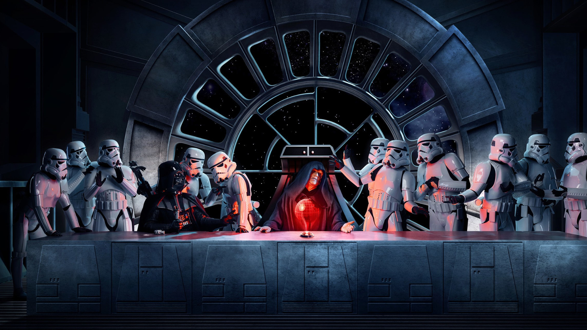

# Tela de Login Star Wars versão 2.0

## ÍNDICE
- <a href="#sobre">Sobre o Projeto</a>   
- <a href="#tecnologias">Tecnologias Utilizadas</a>    
- <a href="#acesse">Acesse Aqui</a> 

## 📝 SOBRE O PROJETO
Apresento a vocês minha tela de login feita com HTML e CSS, inspirada no universo de Star Wars. A ideia é permitir que o usuário, faça um cadastro para se juntar ao Império de Darth Vader e Palpatine. 

Essa é a versão 2.0 do projeto, sendo uma versão melhorada da versão 1.0 (essa versão esta postada no Github também), e foi desenvolvida com os conhecimentos que estou adquirindo em meus estudos no Front-end. Nesse projeto, eu implementei o responsivo para se adaptar diferentes tipos de telas incluindo mobile. 👨‍💻

## 📱 TECNOLOGIAS UTILIZADAS
- HTML
- CSS

## 👇 ACESSE AQUI
Acesse o projeto, nesse link e veja na sua tela <a href="https://deivison556.github.io/TELA-DE-LOGIN-DE-STAR-WARS-versao-2.">https://deivison556.github.io/TELA-DE-LOGIN-DE-STAR-WARS-versao-2.</a>0/

